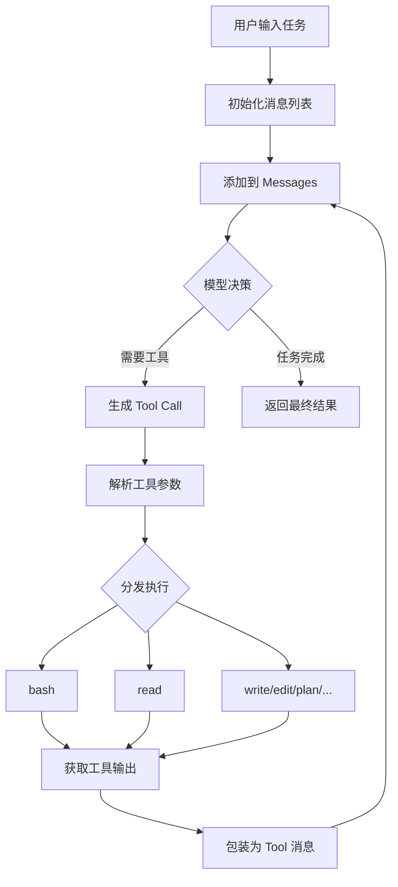
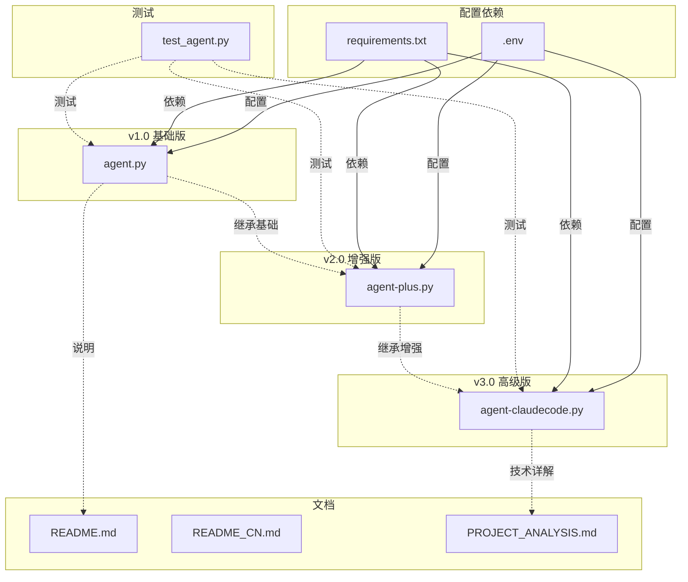

# nanoAgent 项目技术文档

> 版本: 3.0  
> 更新时间: 2026-04-26  
> 项目地址: https://github.com/sanbuphy/nanoAgent

---

## 目录

1. [项目概述](#项目概述)
2. [设计哲学](#设计哲学)
3. [文件结构总览](#文件结构总览)
4. [版本演进说明](#版本演进说明)
5. [核心架构分析](#核心架构分析)
6. [关键算法详解](#关键算法详解)
7. [文件关系图](#文件关系图)
8. [使用指南](#使用指南)

---

## 项目概述

**nanoAgent** 是一个极简主义 AI Agent 框架，展示如何用不到 100 行代码实现一个功能完整的 AI 代理系统。项目通过三个递进版本，完整演示了从基础到高级的 Agent 构建过程。

### 核心特性

| 版本 | 代码量 | 核心特性 |
|------|--------|----------|
| v1.0 (agent.py) | ~100 行 | 基础 ReAct 循环 |
| v2.0 (agent-plus.py) | ~150 行 | +记忆系统 +任务规划 |
| v3.0 (agent-claudecode.py) | ~250 行 | +7专业工具 +MCP协议 +规则系统 |

---

## 设计哲学

nanoAgent 的设计遵循三个核心原则：

### 1. 最小完备性 (Minimal Completeness)

```
原则：用最少的组件实现图灵完备的操作能力

agent.py 中的三工具设计：
├── bash → 执行任意命令（读/写/计算/网络）
├── read_file → 精确读取
└── write_file → 精确定写入

仅需 3 个工具，即可实现任意系统操作
```

### 2. 渐进式增强 (Progressive Enhancement)

```text
v1.0 ──→ v2.0 ──→ v3.0
  │        │         │
  │        │         └── MCP协议支持
  │        │         └── 规则/技能系统
  │        │         └── 7个专业工具
  │        │
  │        └── 记忆系统（上下文连续性）
  │        └── 任务规划（复杂任务分解）
  │        └── 健壮性增强
  │
  └── ReAct核心循环
  └── 基础工具集
  └── 工具分发机制
```

### 3. 生产级鲁棒性 (Production Hardening)

所有版本都包含严格的错误处理：
- 无效 JSON 参数 → 返回错误信息给模型
- 未知工具名称 → 返回明确错误而非崩溃
- 工具执行异常 → 捕获并反馈

---

## 文件结构总览

```
nanoAgent/
├── agent.py                          # 【v1.0】基础版，~100行
├── agent-plus.py                     # 【v2.0】增强版，~150行
├── agent-claudecode.py               # 【v3.0】高级版，~250行
├── agent-plus-commented.py          # 【注释版】agent-plus.py 详解
├── agent-claudecode-commented.py     # 【注释版】agent-claudecode.py 详解
├── tests/
│   ├── test_agent.py                # 回归测试套件
│   └── test_agent_commented.py      # 【注释版】测试详解
├── README.md                         # 英文文档
├── README_CN.md                      # 中文文档
├── LICENSE                           # MIT 许可证
├── requirements.txt                  # 依赖（仅 openai）
└── .env                              # 环境变量配置

配置文件目录（v3.0）:
├── .agent/
│   ├── rules/                        # Markdown规则文件
│   ├── skills/                       # JSON技能定义
│   └── mcp.json                      # MCP服务器配置

运行时生成:
├── agent_memory.md                   # 记忆文件（自动创建）
```

---

## 版本演进说明

### 【v1.0】agent.py - 基础功能演示

**定位**: 极简主义示例，展示 AI Agent 的最低可行实现

**核心能力**:
```python
tools = ["execute_bash", "read_file", "write_file"]

# ReAct 循环
for _ in range(max_iterations):
    response = call_model(messages, tools)  # 1. 模型决策
    if no_tool_calls:
        return response.content               # 2. 任务完成
    result = execute_tools(response)          # 3. 执行工具
    messages.append(result)                   # 4. 反馈结果
```

**适合场景**: 学习理解 Agent 原理、快速原型验证

---

### 【v2.0】agent-plus.py - 生产级增强

**新增功能**:

| 功能 | 实现 | 说明 |
|------|------|------|
| **记忆系统** | `load_memory()` / `save_memory()` | 保存最近50行到 `agent_memory.md` |
| **任务规划** | `create_plan()` | `--plan` 参数启用，自动分解任务 |
| **健壮性** | `parse_tool_arguments()` | 容错参数解析，30秒超时 |

**核心改进**:
```python
# 记忆滑窗机制（保留最近50行）
def load_memory():
    lines = content.split('\n')
    return '\n'.join(lines[-50:])

# 任务规划流程
用户任务 → LLM分解 → 步骤列表 → 逐歩执行 → 合并结果
```

**适合场景**: 需要上下文连续性的实际任务、复杂多步骤任务

---

### 【v3.0】agent-claudecode.py - 企业级实现

**新增7个专业工具**:

| 工具 | 功能 | 相比v2.0的改进 |
|------|------|----------------|
| `read` | 读取文件 | 支持 `offset/limit` 分页 |
| `write` | 写入文件 | - |
| `edit` | 精准替换 | `old_string` 必须唯一出现 |
| `glob` | 文件搜索 | 按修改时间排序 |
| `grep` | 内容搜索 | 递归全文检索 |
| `bash` | 执行命令 | 30秒超时 |
| `plan` | 任务规划 | 内置工具，支持嵌套执行 |

**三大子系统**:

```
┌─────────────────────────────────────────────┐
│            规则系统 (Rules)                  │
├─────────────────────────────────────────────┤
│ 加载路径: .agent/rules/*.md                 │
│ 作用: 注入行为准则到 System Prompt           │
│ 示例: 编码规范、项目约定                      │
└─────────────────────────────────────────────┘
                    ↓
┌─────────────────────────────────────────────┐
│            技能系统 (Skills)                   │
├─────────────────────────────────────────────┤
│ 加载路径: .agent/skills/*.json              │
│ 作用: 预定义任务模板和元信息                   │
│ 示例: {"name": "refactor", "description": ...}│
└─────────────────────────────────────────────┘
                    ↓
┌─────────────────────────────────────────────┐
│            MCP协议 (Model Context Protocol)  │
├─────────────────────────────────────────────┤
│ 配置文件: .agent/mcp.json                   │
│ 作用: 从外部 MCP 服务器加载工具               │
│ 支持: 多服务器配置，可禁用特定服务             │
└─────────────────────────────────────────────┘
```

**适合场景**: 生产环境、团队协作、复杂工程任务

---

## 核心架构分析

### 1. ReAct 架构实现

**理论定义**:
```
ReAct = Reasoning (推理) + Acting (行动)

核心思想: LLM 在思考 (Thought) 和行动 (Action) 之间交替运行
```

**nanoAgent 实现**:



### 2. 工具分发机制

```python
# 服务定位 (Service Locator) 模式
available_functions = {
    "execute_bash": execute_bash,
    "read_file": read_file,
    "write_file": write_file,
    # ...
}

# 字符串名称 → 函数调用的分发
function_impl = available_functions.get(function_name)
if function_impl:
    result = function_impl(**arguments)  # 动态调用
```

**优势**:
- 简洁: 无需复杂的类继承
- 灵活: 可动态添加工具
- 易测试: 方便 Mock

### 3. 参数解析安全层

```python
def parse_tool_arguments(raw_arguments: str) -> dict[str, Any]:
    """
    容错型参数解析
    
    输入场景:           返回:
    ─────────────────────────────────────────
    空参数              → {}  
    无效 JSON '{"a":'   → {"_argument_error": "..."}
    JSON 数组 '[1,2]'   → {}
    有效对象 '{...}'    → {...}
    """
    if not raw_arguments:
        return {}
    try:
        parsed = json.loads(raw_arguments)
        return parsed if isinstance(parsed, dict) else {}
    except json.JSONDecodeError as error:
        return {"_argument_error": f"Invalid JSON: {error}"}
```

### 4. 记忆系统设计

```
设计原理:
┌────────────────────────────────────────────────┐
│ 滑窗机制 (Sliding Window)                       │
├────────────────────────────────────────────────┤
│ 目的: 保畄上下文连贯性，避免超出模型输入限制        │
│ 策略: 只加载最近50行记忆内容                       │
│ 格式: Markdown，便于人工阅读                      │
│ 更新: 追加写入，保留完整历史                       │
└────────────────────────────────────────────────┘

示例记忆格式:
## 2026-04-26 10:30:00
**Task:** 创建 example.py
**Result:** Successfully wrote to example.py

## 2026-04-26 10:31:00
**Task:** 运行 example.py
**Result:** Output: Hello World
```

---

## 关键算法详解

### 算法1: ReAct 循环 (核心控制流)

```python
def run_agent(task, max_iterations=5):
    messages = [
        {"role": "system", "content": "You are ..."},
        {"role": "user", "content": task}
    ]
    
    for iteration in range(max_iterations):
        # 1. 调用模型
        response = client.chat.completions.create(
            model=model,
            messages=messages,
            tools=tools  # 告诉模型有哪些工具
        )
        
        message = response.choices[0].message
        messages.append(message)
        
        # 2. 检查完成
        if not message.tool_calls:
            return message.content  # 任务完成
        
        # 3. 执行工具
        for tool_call in message.tool_calls:
            # 解析参数
            function_name = tool_call.function.name
            arguments = json.loads(tool_call.function.arguments)
            
            # 分发执行
            func = available_functions[function_name]
            result = func(**arguments)
            
            # 4. 反馈结果
            messages.append({
                "role": "tool",
                "tool_call_id": tool_call.id,
                "content": result
            })
    
    return "Max iterations reached"
```

**复杂度**:
- 时间: O(k × n)，k为迭代次数(通常1-5)，n为工具执行时间
- 空间: O(k)，保留的消息历史

---

### 算法2: 任务规划 (Task Planning)

```python
def create_plan(task):
    # 单独调用 LLM 进行任务分解
    response = client.chat.completions.create(
        model=model,
        messages=[
            {"role": "system", "content": "分解为3-5步，返回JSON数组"},
            {"role": "user", "content": f"Task: {task}"}
        ],
        response_format={"type": "json_object"}  # 强制JSON输出
    )
    
    plan_data = json.loads(response.choices[0].message.content)
    steps = plan_data.get("steps", [task])
    return steps
```

**工作流程**:
```
用户: "创建一个Python Web应用"
     ↓
LLM 规划 → [
    "创建项目目录结构",
    "创建 requirements.txt",
    "创建 app.py 入口文件",
    "创建 README.md 说明文档"
]
     ↓
for 每个步骤:
    执行并显示进度
```

---

### 算法3: 嵌套规划执行 (v3.0)

```python
# 全局状态管理嵌套深度
current_plan = []   # 当前规划步骤
plan_mode = False   # 是否处于规划中（防止无限递归）

def plan(task):
    if plan_mode:
        return "Error: Cannot plan within a plan"  # 防递归
    
    # 生成步骤
    steps = create_plan(task)
    current_plan = steps
    
    # 递归执行（不含 plan 工具）
    for step in steps:
        result = run_agent_step(step, tools_without_plan)
        results.append(result)
    
    return "\n".join(results)
```

**关键设计**:
- 全局状态追踪嵌套深度
- 嵌套执行时移除 plan 工具
- 防止 `plan → plan → plan → ...` 无限递归

---

### 算法4: MCP 工具加载

```python
def load_mcp_tools():
    # 读取配置
    with open(".agent/mcp.json") as f:
        config = json.load(f)
    
    mcp_tools = []
    for server_name, server_config in config["mcpServers"].items():
        if server_config.get("disabled"):
            continue  # 跳过禁用服务器
        
        for tool in server_config["tools"]:
            mcp_tools.append({
                "type": "function",
                "function": tool
            })
    
    return mcp_tools

# 合并到基础工具
all_tools = base_tools + mcp_tools
```

---

## 文件关系图



### 依赖关系

```
agent.py
├── openai (外部)
└── 标准库: os, json, subprocess

agent-plus.py
├── openai (外部)
├── 标准库: os, json, subprocess, sys, datetime, typing
└── 继承自 agent.py 的设计模式

agent-claudecode.py
├── openai (外部)
├── 标准库: os, json, subprocess, sys, glob, datetime, pathlib, typing
├── .agent/rules/*.md (配置文件)
├── .agent/skills/*.json (配置文件)
├── .agent/mcp.json (配置文件)
└── 继承自 agent-plus.py 的记忆系统

test_agent.py
├── unittest (标准库)
├── importlib (标准库)
├── types (标准库)
├── agent.py (被测试)
├── agent-plus.py (被测试)
└── agent-claudecode.py (被测试)
```

---

## 版本对比总结

| 特性 | v1.0 | v2.0 | v3.0 |
|------|------|------|------|
| **代码量** | ~100行 | ~150行 | ~250行 |
| **工具数量** | 3 | 3 | 7（+MCP） |
| **记忆系统** | ❌ | ✅ | ✅ |
| **任务规划** | ❌ | ✅ | ✅ |
| **异常处理** | 基础 | 完整 | 完整 |
| **MCP协议** | ❌ | ❌ | ✅ |
| **规则系统** | ❌ | ❌ | ✅ |
| **技能系统** | ❌ | ❌ | ✅ |
| **edit工具** | ❌ | ❌ | ✅ |
| **glob/grep** | ❌ | ❌ | ✅ |
| **分页读取** | ❌ | ❌ | ✅ |
| **超时机制** | ❌ | 30秒 | 30秒 |

---

## 使用指南

### 快速启动

```bash
# 1. 安装依赖
pip install -r requirements.txt

# 2. 配置环境变量
export OPENAI_API_KEY='your-key'
export OPENAI_BASE_URL='https://...'  # 可选
export OPENAI_MODEL='gpt-4o-mini'      # 可选

# 3. 运行
python agent.py "你好，世界"
python agent-plus.py --plan "创建Python项目"
python agent-claudecode.py --plan "查找并修改代码"
```

### 版本选择建议

```
学习/实验    → agent.py
日常任务     → agent-plus.py
复杂工程     → agent-claudecode.py
```

---

## 扩展阅读

- [ReAct 论文](https://arxiv.org/abs/2210.03629)
- [OpenAI Function Calling](https://platform.openai.com/docs/guides/function-calling)
- [MCP 协议](https://modelcontextprotocol.io/)

---

*文档结束*
